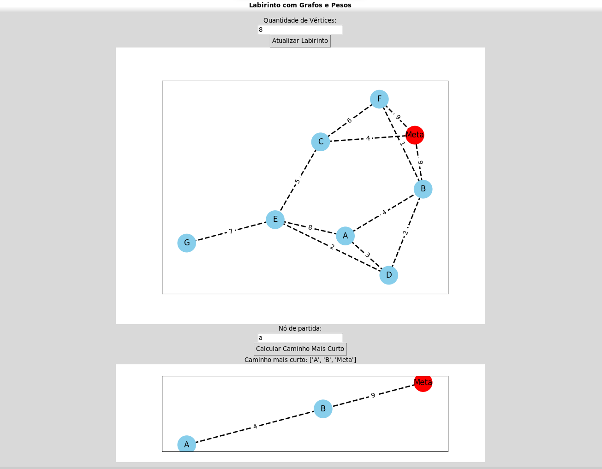
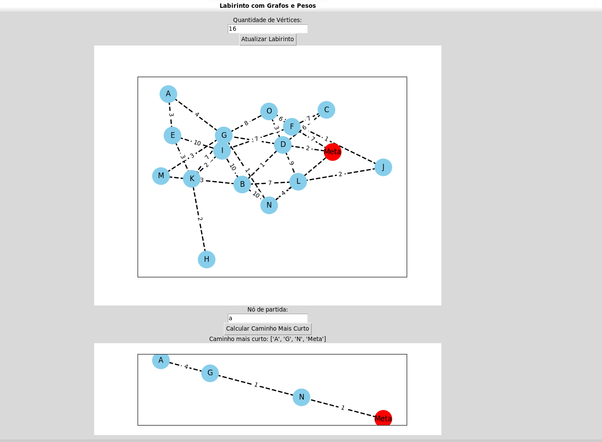

**!! TrilhaLab: Navegando pelo Labirinto !!** 

Temas:
 - Grafos2


## Alunos
|Matrícula | Aluno |
| -- | -- |
| 17/0114139  |  Samuel Victor Castro Macêdo |
| 19/0033427  |  Pedro Henrique Caldeira de Moraes|

## Sobre 
Bem-vindo ao "TrilhaLab: Navegando pelo Labirinto" - uma jornada fascinante em um mundo repleto de desafios e mistérios. Prepare-se para explorar um labirinto dinâmico, onde você deve encontrar o caminho mais curto para alcançar o tesouro escondido no coração do emaranhado de passagens. Utilizando algoritmos inteligentes e uma interface interativa, embarque em uma busca emocionante por soluções eficientes enquanto enfrenta reviravoltas imprevisíveis e surpresas ao longo do percurso. Desvende o código das paredes em constante mudança e desfrute da emoção de mapear um caminho estratégico através do intrincado labirinto. 

## Screenshots







## Instalação 
**Linguagem**: Python<br>

**Dependências**
- Python 3.10.0 ou superior
- instalar as bibliotecas necessárias.
  
**Execução**
- Clone o projeto (ou baixe):
  
  ```shell
  git clone https://github.com/projeto-de-algoritmos/Grafos2_TrilhaLab_Navegando_pelo_Labirinto.git
  && cd Grafos2_TrilhaLab_Navegando_pelo_Labirinto

  ```
- Instale as bibliotecas necessárias:
    ``` 
    pip install networkx
    pip install matplotlib 
    sudo apt get install python3-tk
    ```
 
 - Execute o arquivo principal ```labirinto.py```:
  
    ```shell
    cd Scripts
    python3 labirinto.py 
    ```


## Uso 
1. Insira o número desejado de vértices no campo "Quantidade de Vértices". 
2. Clique no botão "Atualizar Labirinto" para gerar um novo labirinto com base no número de vértices especificado.
3. Insira o nó de partida no campo "Nó de partida".
4. Clique no botão "Calcular Caminho Mais Curto" para descobrir o caminho mais curto até o ponto de destino.
5. Explore as estruturas do labirinto e observe as mudanças na visualização gráfica.Brinque do jeito que quiser com os grafos.
6. Aprecie a jornada de navegação pelo labirinto e desafie-se a encontrar as melhores rotas possíveis.


## Apresentação
[Link Apresentação](https://youtu.be/VvNhG1daDU8)


